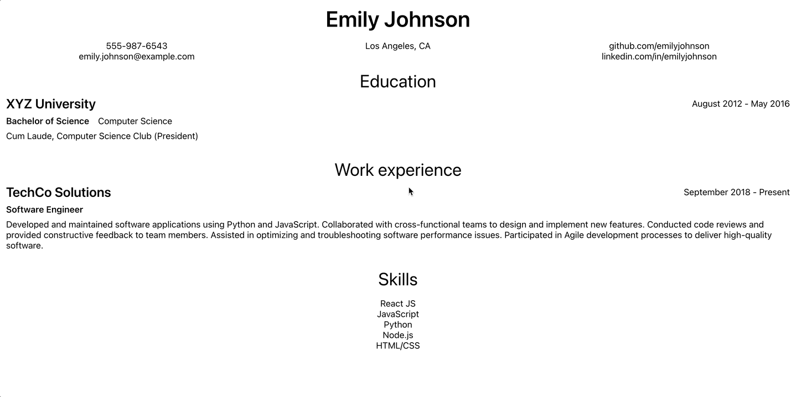
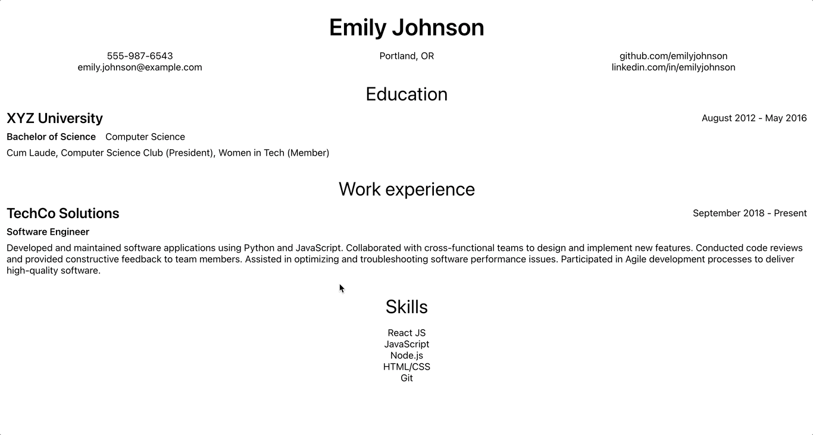

# cv-application
CV application for the <a href="https://www.theodinproject.com/lessons/node-path-javascript-cv-application">Odin Project: JavaScript course</a>

## Skills demonstrated
- React JS
  - Functional components
  - State and props
  - Handling inputs and rendering lists
  - Saving data to localStorage with useEffect hook
- Sass for styling
- <a href="https://www.npmjs.com/package/uuid">UUID</a> for unique keys
- create-react-app

## Features
- Edit sections of a templated CV

- Add or delete additional education experiences, work experiences, and skills

- Print CV without any product features showing

- Begin with welcome pop-up message and return to pop-up message while editing

- Data saves to localStorage for easy return

- Clear localStorage to start over

